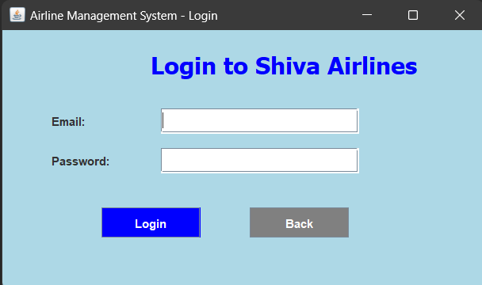
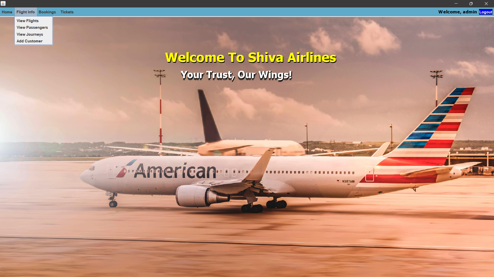
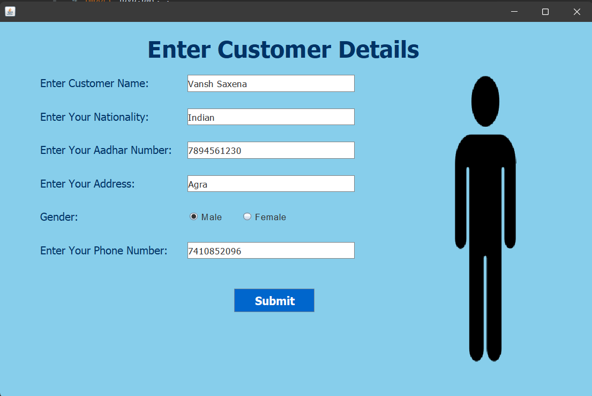
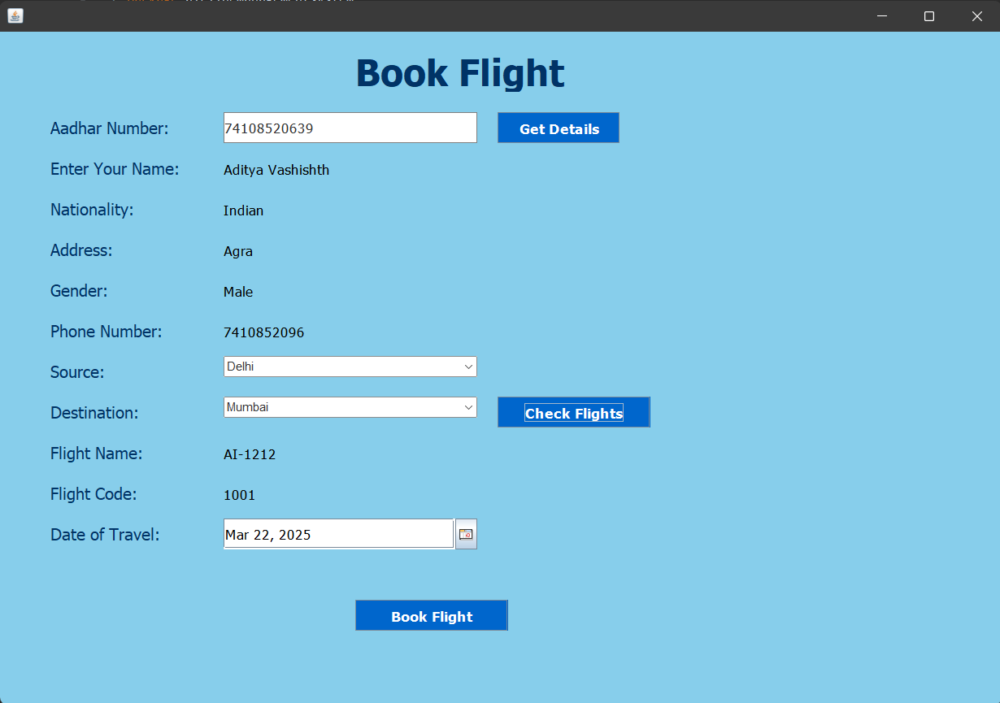
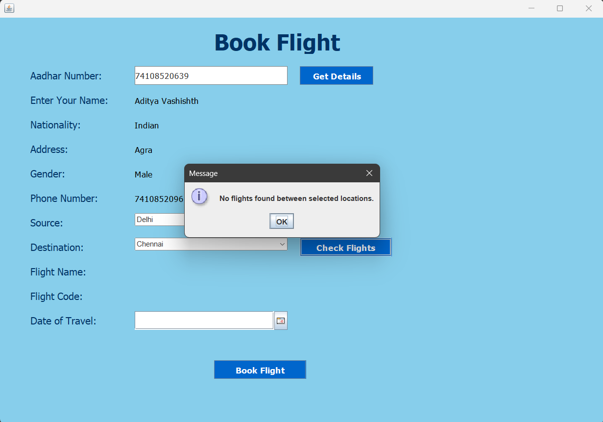
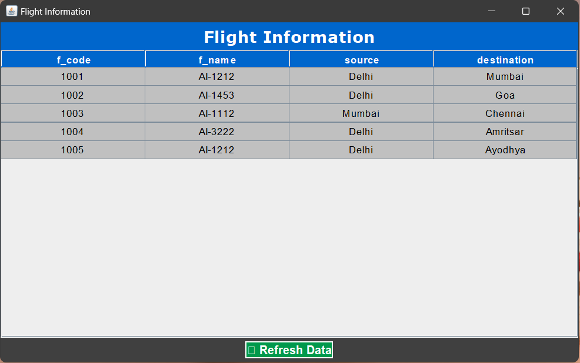
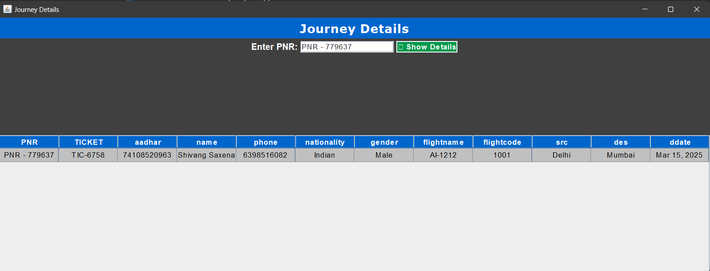
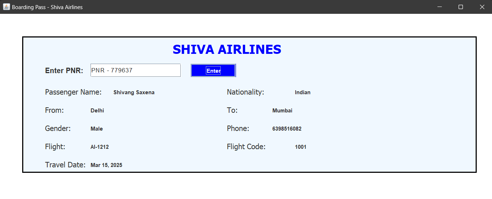
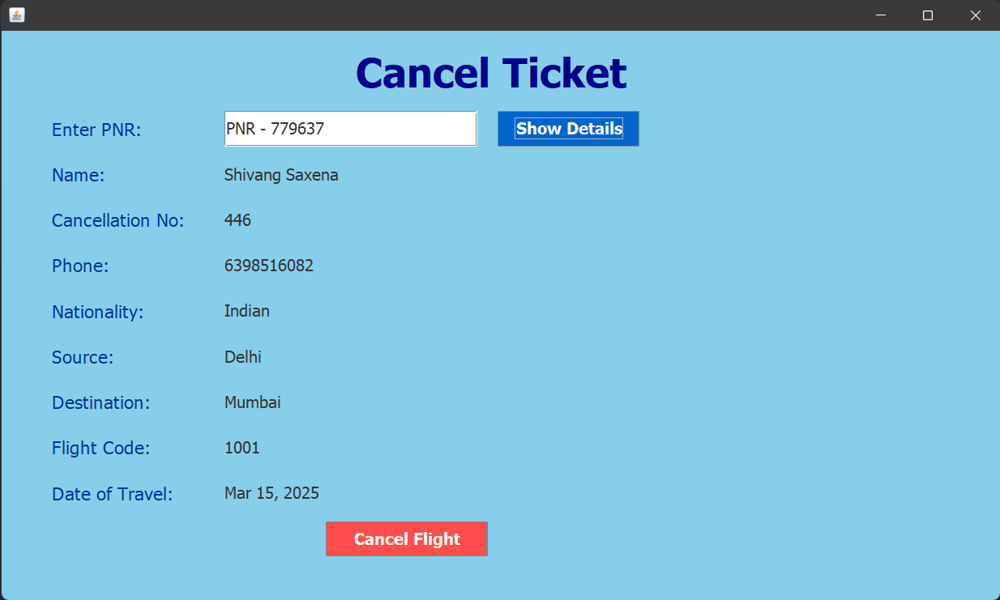

# ✈️ Airline Management System  

The **Airline Management System** is a Java-based desktop application that streamlines **passenger management, flight booking, ticket cancellations, and boarding pass generation**. It is built using **Java Swing for the GUI** and **MySQL for database management**, ensuring efficient handling of airline operations.  

## 🚀 Features  
- **User Authentication** 🔑 – Secure login system  
- **Passenger Management** 👤 – Add and retrieve customer details  
- **Flight Booking** 🛫 – Book flights and check availability  
- **Ticket Cancellation** ❌ – Cancel reservations easily  
- **Boarding Pass Generation** 🏷️ – Retrieve PNR-based boarding passes  
- **Flight Information** 📄 – Display flight schedules and details  

## 🖼️ Screenshots  

### 🔐 Login Page  
  

### 🏠 Home Page (After Login)  
  

### 👤 Add Customer  
  

### 🛫 Book Flight  
  
_Error Handling Example:_  
  

### 📜 Flight Information  
  

### 🎟️ Journey Details  
  

### 🏷️ Boarding Pass  
  

### ❌ Cancel Ticket  
  

## 🛠️ Installation & Setup  

1. **Clone the repository**  
   ```bash
   git clone https://github.com/ShivangSaxena05/Airline_Management_System.git
   cd Airline_Management_System
2. **Setup MySQL Database
  Import the provided SQL file into MySQL
  Update database credentials in Conn.java
3. **Run the application
  javac -d . *.java
  java airlinemanagementsystem.Home
4. **Tech Stack
  Java (Swing, AWT)
  MySQL (JDBC)
  JFrame, JPanel, JButton, JLabel
**Contact
For any queries, feel free to reach out!
